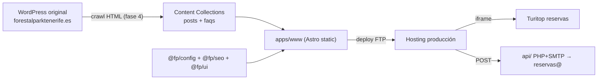

# Arquitectura — forestalpark-web

## Visión general

Sitio estático Astro 5 (monorepo pnpm) que replica visualmente de forma exacta el WordPress original de Forestal Park Tenerife (tema Avada + Yoast). Una **única app** (`apps/www`) sirve las 145 URLs del sitio: páginas corporativas, blog (posts en la raíz del dominio) y 76 FAQ items, en ES (raíz) y EN (`/en/`, slugs traducidos). Las reservas se gestionan con iframes de Turitop (servicio externo); los formularios de contacto irán a un endpoint PHP+SMTP en el hosting.

## Componentes

### apps/www (@fp/www)

Única app Astro. `output: 'static'`, i18n nativo (defaultLocale es, prefixDefaultLocale false), `trailingSlash: 'always'` (baseline — verificación URL a URL pendiente en fase 4). Páginas file-based en `src/pages/` (ES) y `src/pages/en/` (EN) porque los slugs EN son traducciones, no espejos.

**Archivos clave**: `apps/www/astro.config.mjs`, `apps/www/src/content/config.ts`, `apps/www/src/layouts/Layout.astro`

### packages/config (@fp/config)

Preset Tailwind compartido + `siteConfig.ts` (dominio, nombre, datos del negocio).

**Archivos clave**: `packages/config/tailwind.preset.cjs`, `packages/config/src/siteConfig.ts`

### packages/seo (@fp/seo) y packages/ui (@fp/ui)

Esqueletos — se rellenan en fases 7-8 del workflow (schemas JSON-LD estilo villena-web, componentes réplica del maquetado Avada).

## Flujo de datos

1. **Migración (fase 4)**: crawl HTML público del WP → mirror local en `.cache/` (gitignored) → extracción a Content Collections (`posts`, `faqs`) y páginas `.astro`; multimedia espejo completo optimizado con sharp (AVIF/WebP).
2. **Build**: Astro genera HTML estático con las 145 URLs exactas del sitemap original.
3. **Runtime**: sitio estático; iframes Turitop client-side; formularios POST a `api/` PHP+SMTP; dataLayer → GTM (Consent Mode v2).

## Decisiones de diseño

- **Una sola app www** (no app blog separada): los posts viven en la raíz del dominio (`/general/...`) — separar apps rompería las URLs inmutables.
- **URLs inmutables**: cero 301; solo se amplía. Registrado en CLAUDE.md §Boundaries.
- Resto de decisiones en memoria persistente (`mem_save type=decision`) y en `.ypc/runs/init-web-astro-20260612-195317/artifacts/discovery_json.md`.
